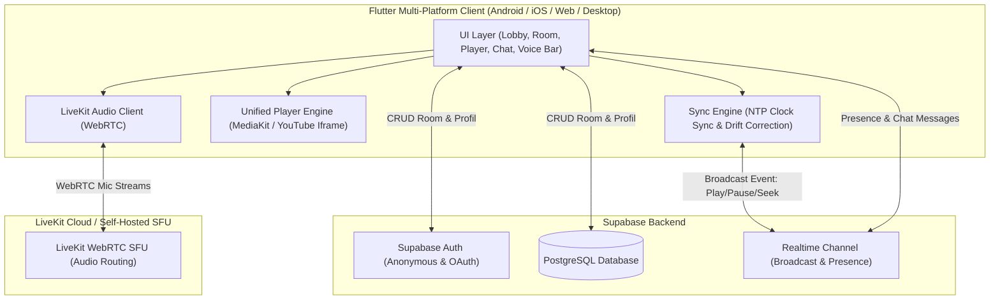

# Rencana Implementasi: Aplikasi Watch Party Multi-Platform (Mirip Rave)

Dokumen ini merupakan panduan arsitektur, spesifikasi teknis, dan roadmap implementasi untuk aplikasi Watch Party multi-platform yang memungkinkan pengguna menonton video secara bersamaan (*synchronized playback*) dengan fitur Text Chat dan Voice Chat (VoIP) real-time.

---

## 1. Ikhtisar & Hasil Kesepakatan (Spesifikasi Kebutuhan)

Berdasarkan diskusi dan kebutuhan yang telah disepakati:
- **Target Platform**: Multi-platform (Android, iOS, Web, Windows, macOS, Linux) dari satu basis kode **Flutter**.
- **Sumber Media (Playback Sources)**:
  1. **YouTube**: Pemutaran video/playlist YouTube via iframe/player integration.
  2. **Direct Video URL**: Streaming file video langsung (MP4, HLS `.m3u8`, WebM) dengan akselerasi hardware.
- **Fitur Komunikasi**:
  1. **Real-time Text Chat**: Pesan instan di dalam room, notifikasi status (user join/leave), dan emoji burst reactions.
  2. **Voice Chat (VoIP)**: Komunikasi audio dua arah berlatensi rendah dengan fitur toggle mic (Mute/Unmute) dan indikator berbicara (*speaking visualizer*).
- **Infrastruktur Backend & Real-time**:
  1. **Supabase**:
     - *Authentication*: Guest/Anonymous login cepat (tanpa ribet daftar) serta opsi Email/OAuth.
     - *PostgreSQL Database*: Data persistence untuk profil pengguna, daftar room, dan riwayat chat.
     - *Supabase Realtime*: Kanal WebSocket untuk broadcast event sinkronisasi (*play/pause/seek*) dan kehadiran peserta (*Presence*).
  2. **LiveKit**:
     - SFU (Selective Forwarding Unit) WebRTC untuk menangani audio stream VoIP berlatensi ultra-rendah dan stabil pada banyak pengguna.
- **Model Hak Kontrol Playback**:
  - *Fleksibel*: Host dapat mengatur room menjadi mode **Host-Only** (hanya host yang bisa play, pause, seek, ganti video) atau **Collaborative** (semua peserta bebas mengontrol).
- **Akses & Privasi Room**:
  - **Public Lobby**: Daftar ruang publik yang dapat dijelajahi siapa saja.
  - **Private Room**: Ruang tertutup yang hanya dapat diakses melalui 6-karakter *Room Code* atau *Invite Link*.
  - **Guest Mode**: Pengguna dapat langsung bergabung hanya dengan memasukkan nama samaran dan memilih avatar.

---

## 2. Arsitektur Sistem



---

## 3. Algoritma Sinkronisasi Video (Drift Detection & Clock Sync)

Tantangan utama aplikasi watch party adalah menjaga agar video semua peserta berada di detik yang sama tanpa menyebabkan *lag* atau video terpotong-potong (*buffering stutter*).

### A. Payload Sinkronisasi (Broadcast Channel)
Ketika controller melakukan aksi (Play, Pause, Seek, atau Heartbeat), event dipancarkan melalui Supabase Realtime Broadcast:

```json
{
  "event": "SYNC_STATE",
  "payload": {
    "media_type": "youtube | direct_url",
    "media_url": "https://...",
    "state": "playing | paused | buffering",
    "position_seconds": 142.3,
    "timestamp_ms": 1725514800000,
    "playback_speed": 1.0,
    "controller_id": "user-uuid"
  }
}
```

### B. Algoritma Koreksi Drift
1. **Sinkronisasi Waktu Lokal dengan Server (NTP Offset)**:
   Aplikasi mengukur selisih waktu perangkat dengan server Supabase saat pertama kali terkoneksi:
   $$\text{ClockOffset} = \text{ServerTime} - \text{LocalTime}$$
2. **Estimasi Posisi Host Real-Time**:
   Saat pesan diterima di client lain:
   $$\Delta t = \frac{(\text{CurrentTime} + \text{ClockOffset}) - \text{timestamp\_ms}}{1000}$$
   $$\text{TargetPosition} = \begin{cases} \text{position\_seconds} + (\Delta t \times \text{playback\_speed}), & \text{jika state} = \text{"playing"} \\ \text{position\_seconds}, & \text{jika state} = \text{"paused"} \end{cases}$$
3. **Kalkulasi Selisih (Drift)**:
   $$\text{Drift} = |\text{TargetPosition} - \text{CurrentLocalVideoPosition}|$$
4. **Strategi Koreksi**:
   - **$\text{Drift} < 300\text{ ms}$ (Toleransi Jitter)**: Tidak melakukan apa-apa agar pemutaran tetap mulus.
   - **$300\text{ ms} \le \text{Drift} < 2000\text{ ms}$ (Micro-Adjustment)**: 
     - Jika client tertinggal: naikkan kecepatan pemutaran menjadi $1.05\times$ atau $1.08\times$.
     - Jika client mendahului: turunkan kecepatan pemutaran menjadi $0.95\times$ atau $0.92\times$.
     - Kembalikan ke $1.0\times$ begitu $\text{Drift} < 100\text{ ms}$.
   - **$\text{Drift} \ge 2000\text{ ms}$ (Hard Seek)**: Langsung panggil `seekTo(TargetPosition)` untuk lompat ke titik waktu yang sama.
5. **Periodic Heartbeat**:
   Host secara otomatis memancarkan `SYNC_STATE` setiap 3–5 detik sekali untuk memastikan peserta baru langsung sinkron.

---

## 4. Skema Database (Supabase PostgreSQL)

```sql
-- 1. Tabel Profil Pengguna
create table profiles (
  id uuid references auth.users on delete cascade primary key,
  username text not null,
  avatar_url text,
  is_guest boolean default false,
  created_at timestamp with time zone default timezone('utc'::text, now())
);

-- 2. Tabel Room Watch Party
create table rooms (
  id uuid default gen_random_uuid() primary key,
  code varchar(8) unique not null,
  title text not null,
  description text,
  host_id uuid references profiles(id) on delete set null,
  is_public boolean default true,
  control_mode text check (control_mode in ('host_only', 'collaborative')) default 'host_only',
  current_media_type text check (current_media_type in ('youtube', 'direct_url', null)),
  current_media_url text,
  current_state text default 'paused',
  current_position float default 0,
  livekit_room_name text not null,
  created_at timestamp with time zone default timezone('utc'::text, now()),
  updated_at timestamp with time zone default timezone('utc'::text, now())
);

-- 3. Tabel Peserta Room
create table room_participants (
  id uuid default gen_random_uuid() primary key,
  room_id uuid references rooms(id) on delete cascade,
  user_id uuid references profiles(id) on delete cascade,
  role text check (role in ('host', 'co_host', 'viewer')) default 'viewer',
  is_muted boolean default false,
  joined_at timestamp with time zone default timezone('utc'::text, now()),
  unique(room_id, user_id)
);

-- 4. Tabel Pesan Chat Room
create table room_messages (
  id uuid default gen_random_uuid() primary key,
  room_id uuid references rooms(id) on delete cascade,
  user_id uuid references profiles(id) on delete set null,
  content text not null,
  type text check (type in ('text', 'system', 'emoji_reaction')) default 'text',
  created_at timestamp with time zone default timezone('utc'::text, now())
);

-- Indeks Performa
create index idx_rooms_code on rooms(code);
create index idx_rooms_is_public on rooms(is_public);
create index idx_room_messages_room_id on room_messages(room_id, created_at);
```

---

## 5. Struktur Direktori Proyek (Flutter Clean Architecture)

```
watch_party_app/
├── pubspec.yaml
├── lib/
│   ├── main.dart                       # Entry point aplikasi
│   ├── app.dart                        # Konfigurasi MaterialApp, Theme, dan GoRouter
│   ├── core/
│   │   ├── constants/                  # Konfigurasi Supabase, LiveKit URL, warna tema
│   │   │   ├── app_colors.dart
│   │   │   └── api_constants.dart
│   │   ├── network/                    # Supabase Client Singleton & API Helpers
│   │   │   └── supabase_client.dart
│   │   ├── theme/                      # Rave-style dark neon visual system
│   │   │   └── app_theme.dart
│   │   ├── utils/                      # Clock offset calculator & formatters
│   │   │   ├── ntp_clock_sync.dart
│   │   │   └── time_formatter.dart
│   │   └── routes/                     # Definisi rute GoRouter (Lobby, Room)
│   │       └── app_router.dart
│   └── features/
│       ├── auth/                       # Guest login & autentikasi
│       │   ├── data/
│       │   ├── domain/
│       │   └── presentation/
│       ├── lobby/                      # Eksplorasi room & pembuatan room
│       │   ├── data/
│       │   ├── presentation/
│       │   │   ├── lobby_screen.dart
│       │   │   ├── widgets/create_room_dialog.dart
│       │   │   └── widgets/join_code_dialog.dart
│       ├── room/                       # Layar inti Watch Party
│       │   ├── controllers/            # SyncController & RoomController
│       │   │   └── sync_controller.dart
│       │   ├── models/                 # RoomState & SyncPayload
│       │   └── presentation/
│       │       ├── room_screen.dart
│       │       └── widgets/
│       │           ├── unified_player_view.dart
│       │           ├── media_source_picker.dart
│       │           ├── room_controls_bar.dart
│       │           └── participants_header.dart
│       ├── chat/                       # Text chat real-time & reactions
│       │   ├── controllers/
│       │   │   └── chat_controller.dart
│       │   └── presentation/
│       │       ├── chat_panel_widget.dart
│       │       └── floating_reaction_overlay.dart
│       └── voice/                      # VoIP LiveKit WebRTC
│           ├── controllers/
│           │   └── livekit_voice_controller.dart
│           └── presentation/
│               ├── voice_control_bar.dart
│               └── speaking_avatar_indicator.dart
```

---

## 6. Daftar Library Utama yang Digunakan

1. **State Management & Routing**:
   - `flutter_riverpod: ^2.5.1` - State management reaktif, modular, dan terstruktur.
   - `go_router: ^14.0.0` - Routing deklaratif yang mendukung deep link room URL.
2. **Pemutar Media & Video**:
   - `media_kit: ^1.1.10` & `media_kit_video: ^1.2.4` - Pemutar video performa tinggi berbasis *libmpv* (hardware acceleration) untuk file MP4 dan live stream HLS (`.m3u8`) di semua platform.
   - `youtube_player_iframe: ^5.1.2` - Pemutar resmi iframe YouTube yang kompatibel untuk web, desktop, dan mobile.
3. **Backend, Database & Real-time**:
   - `supabase_flutter: ^2.5.0` - SDK lengkap untuk auth, query database Postgres, presence, dan broadcast websocket.
4. **Voice Chat WebRTC**:
   - `livekit_client: ^2.1.0` - SDK resmi LiveKit untuk audio streaming VoIP low-latency, manajemen mic, noise reduction, dan event speaker visualizer.
5. **Animasi & Utilitas UI**:
   - `flutter_animate: ^4.5.0` - Animasi halus untuk pesan chat dan reaksi emoji melayang.
   - `uuid: ^4.3.3` - Generator ID unik untuk tracking event sinkronisasi.

---

## 7. Roadmap Pengerjaan Bertahap (Phased Roadmap)

### **Fase 1: Inisialisasi Proyek & Backend Setup**
- Setup Flutter project baru dengan struktur multi-platform.
- Inisialisasi konfigurasi Supabase (tabel database, Row Level Security / RLS, dan Anonymous Auth).
- Implementasi Splash / Welcome Screen untuk Guest Login (input nama & pilih avatar).

### **Fase 2: Unified Video Player Engine**
- Konfigurasi engine pemutar `media_kit` untuk menangani Direct Video URL (MP4 / HLS).
- Konfigurasi `youtube_player_iframe` untuk konten YouTube.
- Pembuatan wrapper antarmuka `VideoPlayerControllerInterface` agar UI room dapat mengontrol kedua tipe pemutar secara seragam.

### **Fase 3: Realtime Video Synchronization Engine**
- Pembuatan kanal Supabase Realtime Broadcast per room.
- Implementasi logika perhitungan drift $\Delta$ dan koreksi bertingkat (micro-speed adjust vs hard seek).
- Penegakan aturan izin (*Host Only* vs *Collaborative Mode*).
- Implementasi auto-heartbeat controller setiap 3 detik.

### **Fase 4: Manajemen Room & Real-time Text Chat**
- Pembuatan UI Public Lobby (list room terbuka, status media, jumlah penonton).
- Dialog Pembuatan Room (pilihan kontrol, visibilitas publik/privat, generate kode room 6 huruf).
- Implementasi Text Chat via Supabase Realtime:
  - Bubble pesan teks dengan avatar pengirim.
  - Pesan sistem (contoh: "User A bergabung", "User B mengubah video").
  - Quick emoji reactions yang melayang di atas video (*floating reactions*).

### **Fase 5: Integrasi Voice Chat (LiveKit WebRTC)**
- Setup koneksi ke room LiveKit saat pengguna masuk ke room.
- Pembuatan UI kontrol audio: tombol toggle mic (Mute/Unmute) dan indikator visual avatar yang bersinar hijau ketika pengguna sedang bersuara.
- Audio ducking opsional: secara halus menurunkan sedikit volume video saat ada teman yang berbicara di VoIP.

### **Fase 6: UI/UX Styling & Multi-Platform Polish**
- Penerapan tema gelap neon modern (estetika Rave).
- Desain tata letak responsif:
  - *Mobile Portrait*: Video di bagian atas, panel chat & kontrol di bawah.
  - *Tablet / Desktop / Web*: Video berukuran besar di sisi kiri, panel chat & daftar peserta di sisi kanan.

### **Fase 7: Pengujian & Verifikasi**
- Pengujian unit untuk logika kompensasi drift (`SyncControllerTest`).
- Pengujian interaksi multi-perangkat (membuka 2 client secara bersamaan untuk menguji sinkronisasi play/pause/seek dan suara mic).

---

## 8. Panduan Menjalankan & Menyiapkan Environment

### Kebutuhan Sistem:
- **Flutter SDK**: versi `>= 3.19.0`
- **Akun Supabase**: Proyek baru untuk URL & Anon Key (free tier tersedia).
- **Akun LiveKit Cloud** (atau self-hosted): Proyek baru untuk WebSocket URL & Token dispenser (free tier tersedia).

File konfigurasi kredensial disimpan di `.env` (dan template di `.env.example`):
```env
SUPABASE_URL=https://afqauloszakvukebwzdl.supabase.co
SUPABASE_PUBLISHABLE_KEY=sb_publishable_QFrZVWOv5mzBQBUwjsKiCw_W15Zh5md
# Simpan SECRET_KEY di backend/admin saja:
SUPABASE_SECRET_KEY=sb_secret_YOUR_KEY_HERE
SUPABASE_JWKS_URL=https://afqauloszakvukebwzdl.supabase.co/auth/v1/.well-known/jwks.json
```

Dalam kode Flutter (`api_constants.dart`), hanya gunakan URL dan Publishable/Anon Key untuk keamanan:
```dart
const String supabaseUrl = 'https://afqauloszakvukebwzdl.supabase.co';
const String supabaseAnonKey = 'sb_publishable_QFrZVWOv5mzBQBUwjsKiCw_W15Zh5md';
```

